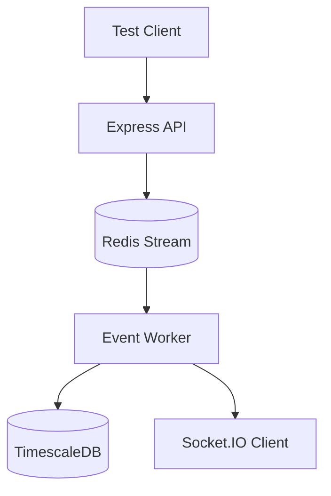

# Testing Documentation

This project uses a multi-layered testing strategy (Unit, Integration, and End-to-End) powered by **Jest** and **Docker**.

---

## 🚀 Quick Start

Ensure **Docker Desktop** is running, then use the following commands:

```bash
# Run all tests sequentially
npm test

# Run tests with coverage reporting
npm run test:coverage

# Run a specific test file
npx jest tests/unit/schema.test.ts
```

---

## ️ Architecture

We use a **distributed testing strategy** with real infrastructure to ensure high reliability.



### 1. Unit Tests (`tests/unit/`)

- **Focus**: Pure logic and helper functions.
- **Dependencies**: Fully mocked. No database required.
- **Goal**: Instant feedback on core validation and formatting.

### 2. Integration Tests (`tests/integration/`)

- **Focus**: API endpoints and database communication.
- **Dependencies**: Real Docker containers (Postgres/Redis).
- **Goal**: Verify that your SQL and Redis queries work correctly.

### 3. E2E Tests (`tests/e2e/`)

- **Focus**: The "Track-to-Socket" distributed flow.
- **Dependencies**: Full stack (API + Worker + DB + Sockets).
- **Goal**: Verify that an event travels safely from ingestion to live dashboard update.

---

## 🔄 Infrastructure Lifecycle

The testing suite manages its own Docker containers automatically using Jest global hooks:

1.  **Start**: `tests/globalSetup.ts` spins up `docker-compose.test.yml`.
2.  **Ready**: It waits until Postgres and Redis are fully healthy.
3.  **Run**: Tests execute sequentially (`--runInBand`) using configurations from `.env.test`.
4.  **Stop**: `tests/globalTeardown.ts` removes the containers and cleans up data.

---

## 🔒 Configuration

- **`jest.config.ts`**: Main test runner configuration.
- **`docker-compose.test.yml`**: Isolated infrastructure (Postgres: 5433, Redis: 6380).
- **`.env.test`**: Test-specific environment variables.

---

## 📈 Coverage Requirements

The CI pipeline requires **80% coverage** for code formatting, linting, and type-safety check. Ensure your tests hit at least 80% of lines before pushing to production.
